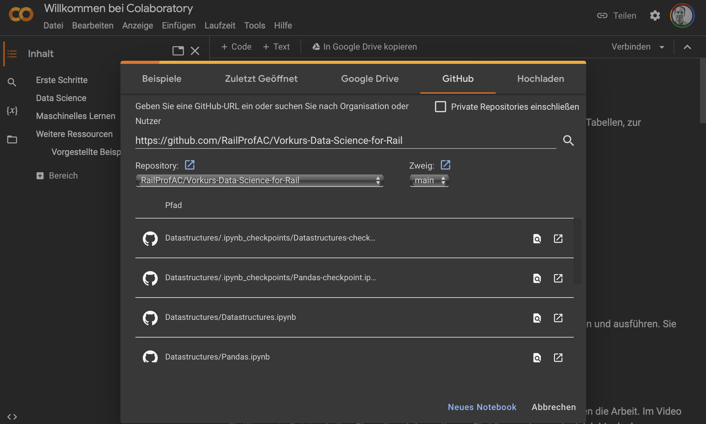

# Vorkurs Rail Data Science

Repository für den Vorkurs.

## Wie Python und Jupyter nutzen?

### Python

## 

## Skripte online ausführen

Das ist an vielen Orten online möglich, z.B. bei [Python.org](https://www.python.org/shell/).

### Jupyter Notebooks

#### Einfach und schnell: Ausführung in Binder

Binder ist ein Webinterface, das die Ausführung von Jupyter Notebooks online erlaubt:

Da es sich um einen kostenlosen, von Sponsoren ermöglichten Dienst handelt, ist die Verfügbarkeit manchmal schlecht.

#### Sehr performant mit google Account: Colab

Unter [colab.research.google.com](https://colab.research.google.com) bietet google sehr performante Maschinen bereits im kostenlosen Bereich an.
Beim Starten "GitHub" auswählen und dieses Repository eingeben:

~~~
https://github.com/RailProfAC/Vorkurs-Data-Science-for-Rail
~~~

Dort dann das jeweilige Notebook ausführen.

#### Lokale Installation

Alternativ bietet sich die lokale Installation an, hier ist das Paket von [Anaconda](https://www.anaconda.com/download) zu empfehlen. Ein Video zu Installation findet ihr [hier](https://vimeo.com/680110960?share=copy).

## Alle Videos in einer Playlist

<iframe src='https://vimeo.com/showcase/10413895/embed' allowfullscreen frameborder='0' style='position:absolute;top:0;left:0;width:100%;height:100%;'></iframe>

